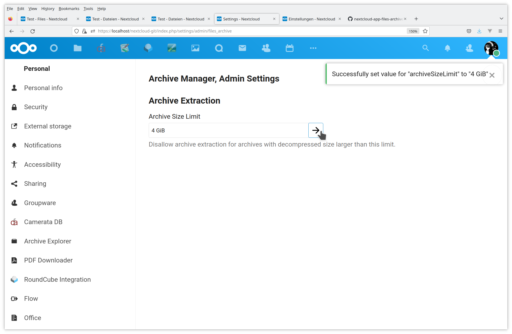
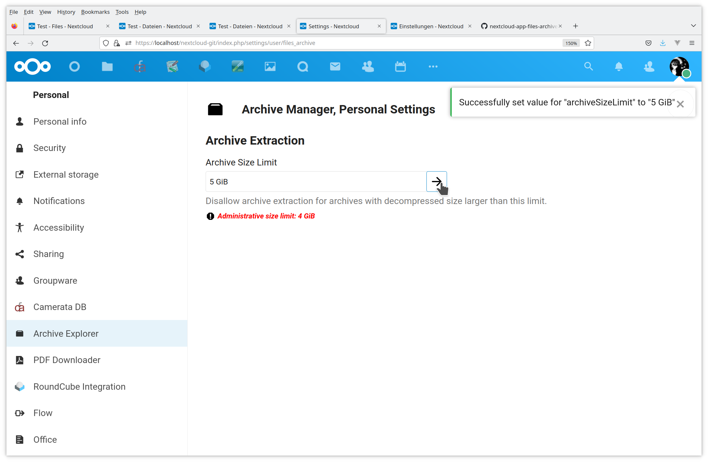
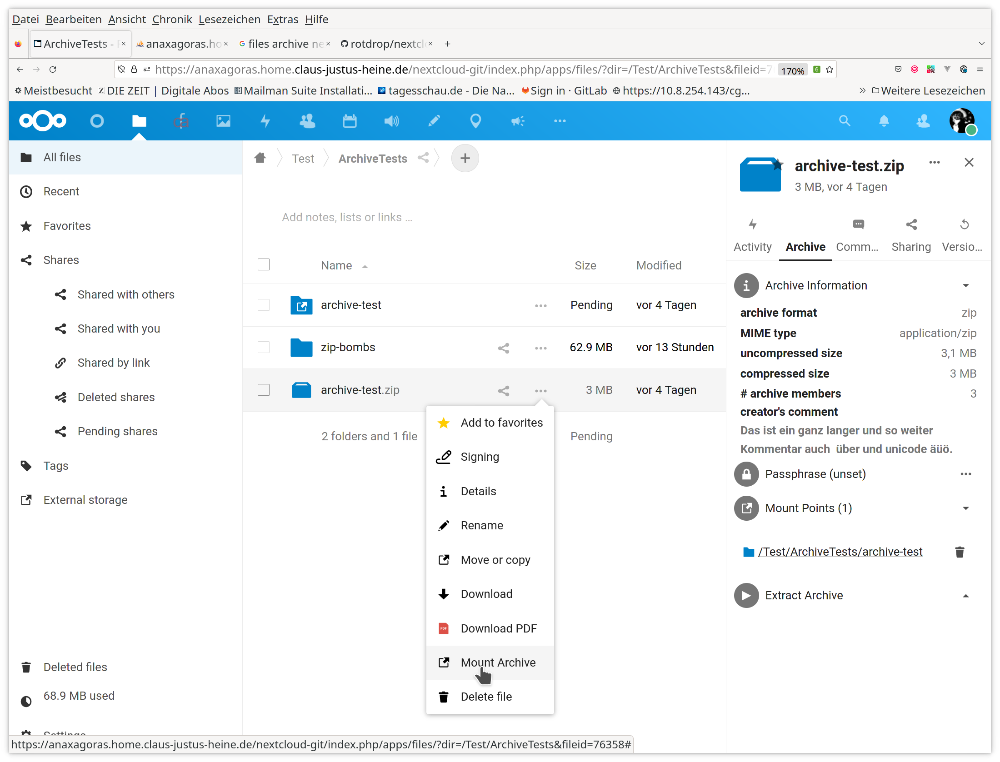
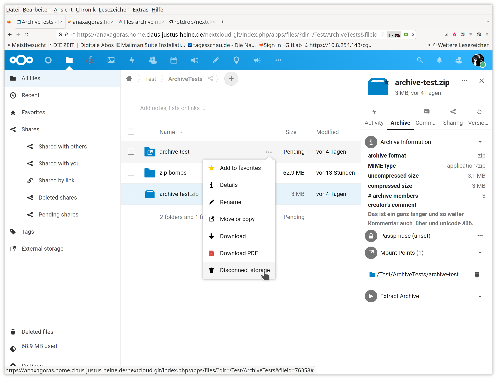
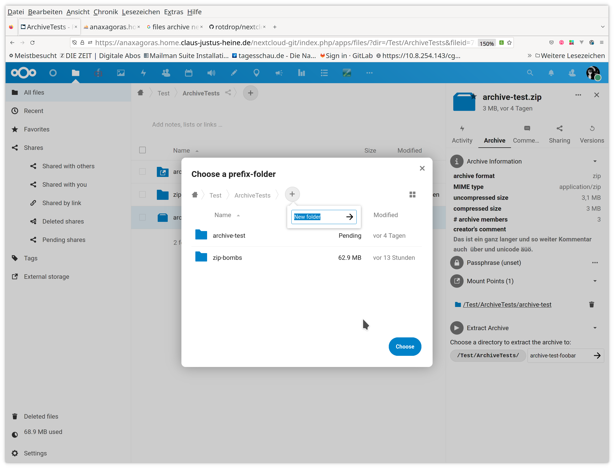
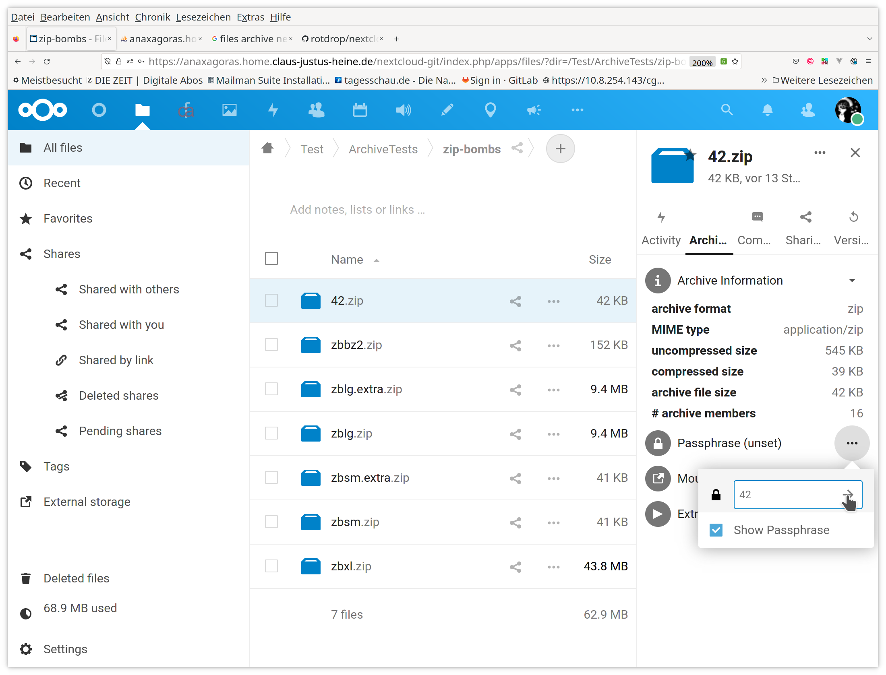
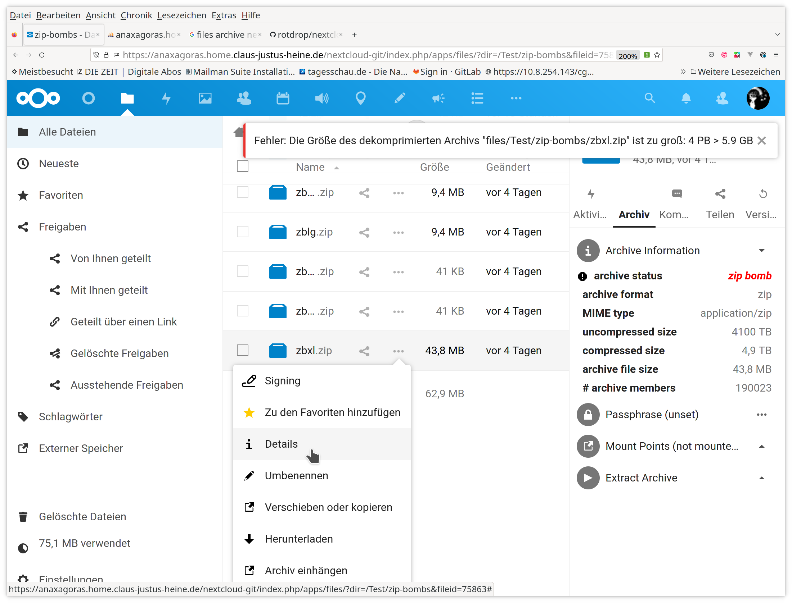

# Archive Inspector and Extractor

<!-- markdown-toc start - Don't edit this section. Run M-x markdown-toc-refresh-toc -->
**Table of Contents**

- [Intro](#intro)
- [Details](#details)
  - [State](#state)
  - [Usage](#usage)
  - [Supported Archive Formats](#supported-archive-formats)
  - [Security](#security)
    - [ZIP-Bombs](#zip-bombs)
    - [Passphrases and Encrypted Archives](#passphrases-and-encrypted-archives)
  - [Efficiency](#efficiency)
  - [Implementation](#implementation)
  - [Alternatives](#alternatives)
- [Screenshots](#screenshots)
  - [Preferences](#preferences)
  - [Files-List](#files-list)
    - [Mount](#mount)
    - [Unmount](#unmount)
    - [Extract](#extract)
    - [Pass-Phrase](#pass-phrase)
    - [ZIP-Bomb](#zip-bomb)

<!-- markdown-toc end -->

## Intro
This is an app for the Nextcloud cloud software.

- archive inspection is implemented as an external mount where
  archive members are streamed on the fly as they are accessed
- archive extraction extracts the archive contents into the file-space
  of the cloud. The app tries to be quota-aware while doing this.

The app adds an item to the file-actions menu which lets you mount the
archive file as "external" mount into the current directory. This
mount is "movable" and can be renamed or moved into another folder.

The app further adds an entry to the details-view in the right
side-bar wheren archive information is displayed, and controls for
mounting and extracing the archive to any location in the cloud
file-system are available.

## Details

### State

Works for me.

### Usage

- The file-actions menu contains a menu-item "Mount Archive" which
  lets you mount the archive file as virtual folder into the current
  directory.
- The mount is movable, so it can be renamed later or moved somewhere
  else.
- Unmounting an archive storage is available through the file-actions
  menu of the mount-point, just click on "Disconnect Storage".
- Additionally, there is an "Archive"-tab in the details view of the
  archive-file. There you find some "meta-information" like
  uncompressed size, number of archive members, creator's comment, as
  well as the controls to mount the archive file anywhere into the
  cloud file-system or to extract it somewhere.

### Supported Archive Formats

In principle every format supported by the underlying backend
[wapmorgan/UnifiedArchive](https://github.com/wapmorgan/UnifiedArchive) should be
supported. There are some caveats, however:

- the way the `files_app` is integrated into Nextcloud means that is
  relies on Nextcloud emitting useful MIME-types for a file. This
  might need some configuration of the Nextcloud server which has to
  be done by an administrator. One notable example are ISO-images,
  which are just labelled as `application/octett-stream` (AKA: I DO
  NOT KNOW) by Nextcloud, but should be
  `application/x-iso9660-image`. Please have a look
  [at the Nextcloud documentation](https://docs.nextcloud.com/server/latest/admin_manual/configuration_mimetypes/index.html).
  Example configuration files can be found in the [config directory](config/README.md).
- for some file-types there are different MIME-types. One example of
  such a case are `.rar` files which are labelled by Nextcloud as
  `application/x-rar-compressed` while
  [wapmorgan/UnifiedArchive](https://github.com/wapmorgan/UnifiedArchive)
  expects `application/x-rar`. These sort of things can be easily
  cured but may also be reason why particular archive formats are not
  supported by this app although the underlying backend can handle
  them.

### Security

#### ZIP-Bombs
- in order to somehow reduce the danger of
  [zip-bombs](https://en.wikipedia.org/wiki/Zip_bomb) there is a
  configurable upper limit of the decompressed archive size
- administrators can set this limit in order to reduce resource
  usage on the server or if they feel that the builtin limit of 2^32
  (4 GiB) bytes is too high.
- users may decrease this limit further on a per-user basis
- zip-bombs which manage too fool the archive extraction software
  about their uncompressed size can obviously not be detected by this
  approach.
- the classical `42.zip` should not be an issue as it works by nesting
  zip-files into each other, so it can only attack recursive archive
  extractors.
- archive extraction respects the quota limits of the respective user
- however, there might be further issues if the underlying archive
  extraction software creates temporary files on the server
  - perhaps it would be possible to "jail" the extraction software to
    an OS-quota-limited directory in order to avoid
    resource-exhaustion by temporary files
- memory consumption in principle should already be capped by the
  web-server configuration, so this should not be a security issue in
  the context of a zip-bomb attack.

#### Passphrases and Encrypted Archives
- Decryption of encrypted archives is in principle supported as stated
  in the documentation of the used
  [backend](https://github.com/wapmorgan/UnifiedArchive).
- Unfortunately, the Nextcloud CRON-jobs need to have access to the
  file-space as they periodically scan the file-system. However, the
  cron-jobs run unauthenticated. In order to make this work, the
  archvie passwords for the active mounts are stored in the app's
  database table. The passwords are encrypted with the server
  password. However, that is stored in plain-text in the `config.php`
  of the Nextcloud instance running on the server.
- I do not like this, but BTW this is also the way these things are
  handled by other apps (eg. the `mail` app).
- One note about encrypted ZIP-archives: depends in a delicate way on
  the used backend whether decrypion works as some of the open-source
  archive backend do not support all available ZIP encryption methods
  (and also not all unencrypted ZIP archive formats).
- At the moment we are choosing the first available archive-backend
  from the following list
  - [`Gemorroj/Archive7z`](https://github.com/Gemorroj/Archive7z)
  - [php ZIP extension](https://www.php.net/manual/en/book.zip.php)
  - [`Ne-Lexa/php-zip`](https://github.com/Ne-Lexa/php-zip)
  - [`alchemy-fr/Zippy`](https://github.com/alchemy-fr/Zippy)
- There is no real preference for any of these backends from my side,
  just that I was not able to decrypt one archive with the standard PHP
  ZIP extension and stopped testing after I found one that worked.

###  Efficiency
- Archive access is implemented on a single-file access basis. This is
  probably not the fastest way to deal with archive files. OTOH, it
  makes it easier to deal with quota and other limits, which then are
  handled easily by the Nextcloud file-system framework.

### Implementation
This package relies on
[`wapmorgan/unified-archive`](https://github.com/wapmorgan/UnifiedArchive)
as archive handling backend. Please see there for a list of supported
archive formats and how to support further archive formats.

All what this package does is to provide the Nextcloud
integration. Possibly the archive backend could be changed or there
could be more than one backend in the future, but intentionally this
package just cares about the integration into the cloud-software, but
does not add own archive-file handling stuff.

### Alternatives

- [Nextcloud Extract](https://github.com/PaulLereverend/NextcloudExtract)

## Screenshots

### Preferences

- admin 
- personal 

### Files-List

#### Mount

#### Unmount

#### Extract

#### Pass-Phrase

#### ZIP-Bomb

