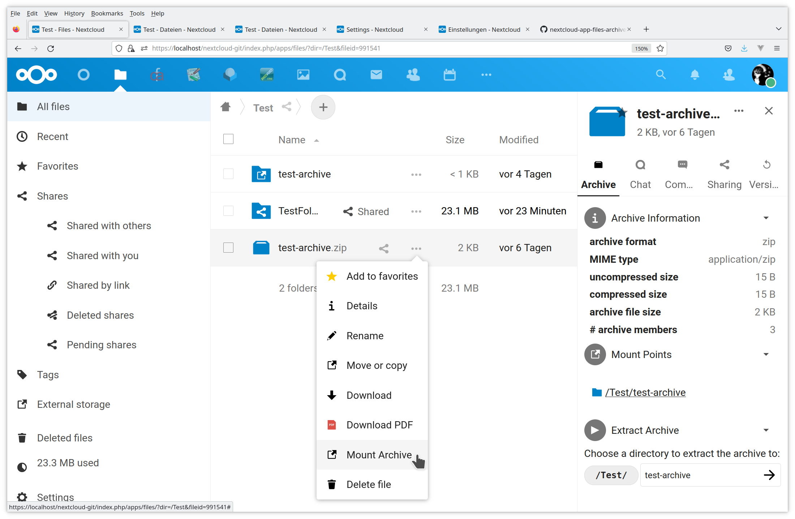
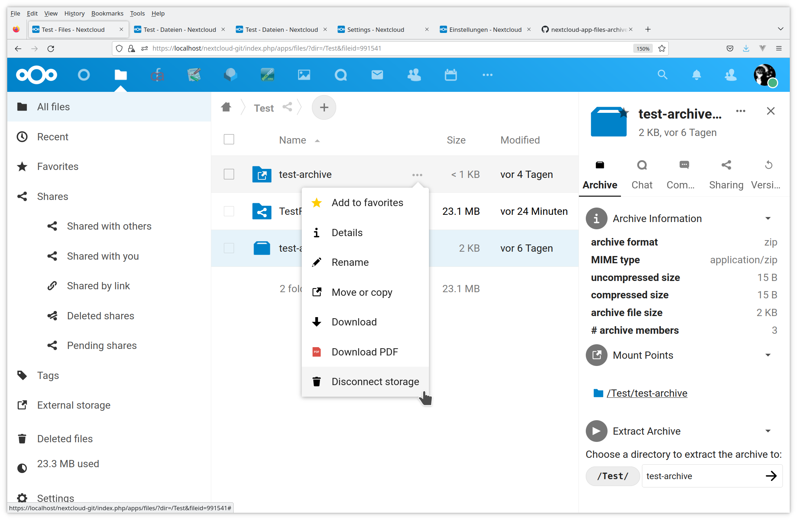
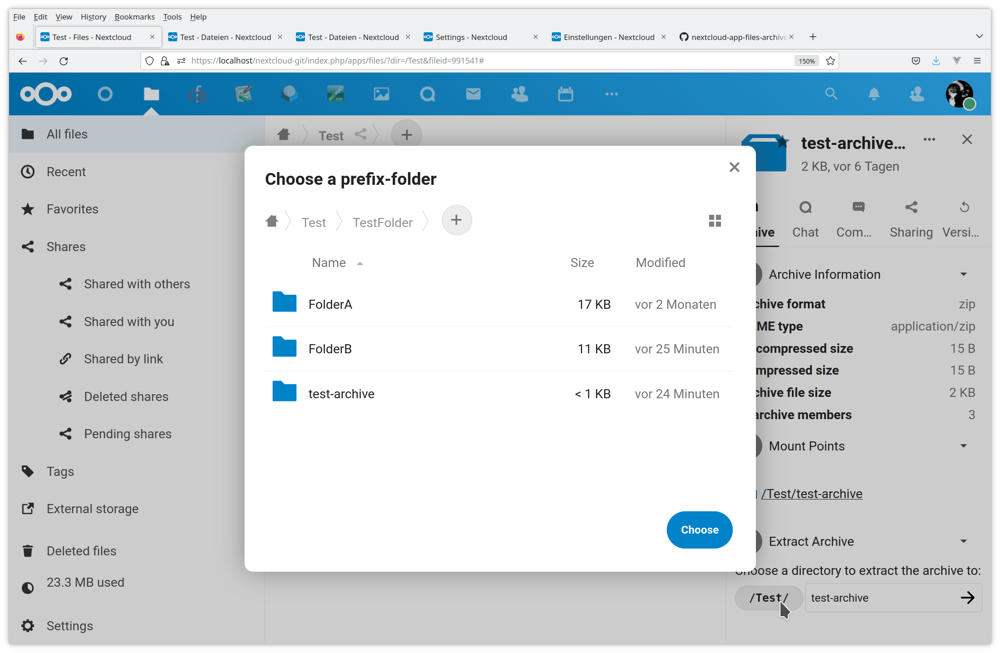

# Archive Inspector and Extractor

## Intro
This is an app for the Nextcloud cloud software.

- archive inspection is implemented as an external mount where
  archive members are streamed on the fly as they are accessed
- archive extraction extracts the archive contents into the file-space
  of the cloud. The app tries to be quota-aware while doing this.

The app adds an item to the file-actions menu which lets you mount the
archive file as "external" mount into the current directory. This
mount is "movable" and can be renamed or moved into another folder.

The app further adds an entry to the details-view in the right
side-bar wheren archive information is displayed, and controls for
mounting and extracing the archive to any location in the cloud
file-system are available.

## Details

### State

Works for me.

### Usage

- The file-actions menu contains a menu-item "Mount Archive" which
  lets you mount the archive file as virtual folder into the current
  directory.
- The mount is movable, so it can be renamed later or moved somewhere
  else.
- Unmounting an archive storage is available through the file-actions
  menu of the mount-point, just click on "Disconnect Storage".
- Additionally, there is an "Archive"-tab in the details view of the
  archive-file. There you find some "meta-information" like
  uncompressed size, number of archive members, creator's comment, as
  well as the controls to mount the archive file anywhere into the
  cloud file-system or to extract it somewhere.

### Security

- in order to somehow reduce the danger of
  [zip-bombs](https://en.wikipedia.org/wiki/Zip_bomb) there is a
  hard-coded upper limit of the decompressed archive size
- administrators can lower this limit in order to reduce resource
  usage on the server or if they feel that the builtin limit of 2^32
  (4 GiB) bytes is too high.
- users may decrease this limit further on a per-user basis
- zip-bombs which manage too fool the archive extraction software
  about their uncompressed size can obviously not be detected by this
  approach.
- archive extraction respects the quota limits of the respective user

###  Efficiency
- Archive access is implemented on a single-file access basis. This is
  probably not the fastest way to deal with archive files.

### Implementation
This package relies on
[`wapmorgan/unified-archive`](https://github.com/wapmorgan/UnifiedArchive)
as archive handling backend. Please see there for a list of supported
archive formats and how to support further archive formats.

All what this package does is to provide the Nextcloud
integration. Possibly the archive backend could be changed are there
could be more than one backend in the future, but intentionally this
package just cares about the integration into the cloud-software, but
does not add own archive-file handling stuff.

## Screenshots

### Preferences

- admin
- personal

### Files-List

- mount 
- unmount 
- extract 
